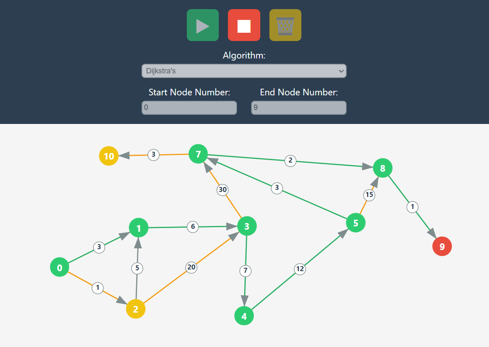

# Dijkstrafy 🔍

**Dijkstrafy** is an interactive graph algorithm visualizer built with **React** and **TypeScript**. It lets you create custom graphs and observe how different **shortest path algorithms** work in real time:

* 🟢 **Dijkstra's Algorithm**
* 🟠 **Bellman-Ford Algorithm**
* 🔵 **SPFA (Shortest Path Faster Algorithm)**

---

## 📚 Table of Contents

- [🌐 Live Demo](#-live-demo)
- [✨ Features](#-features)
- [🕹️ Getting Started](#-getting-started)
  - [How to Use Dijkstrafy](#how-to-use-dijkstrafy)
  - [Visualization Colors](#visualization-colors)
- [🧠 Core Concepts](#-core-concepts)
  - [What is a Graph?](#what-is-a-graph)
  - [What Are Negative Weights?](#what-are-negative-weights)
  - [Which Algorithms Support Negative Weights?](#which-algorithms-support-negative-weights)
- [🔍 Algorithms Overview](#-algorithms-overview)
  - [Dijkstra’s Algorithm](#dijkstras-algorithm)
  - [Bellman-Ford](#bellman-ford)
  - [SPFA (Shortest Path Faster Algorithm)](#spfa-shortest-path-faster-algorithm)
- [🌍 Why Pathfinding Matters](#-why-pathfinding-matters)
- [🛠 Tech Stack](#-tech-stack)
- [🚀 Local Setup](#-local-setup)

---

# 🌐 Live Demo 👉 [Try it out here](https://akirakii.github.io/dijkstrafy/) 👈



Create, explore, and learn how pathfinding works in graphs! 🚀

---

## ✨ Features

* Interactive **graph editor**: add, connect, and delete nodes and edges
* Visual **step-by-step algorithm execution**
* **Supports negative weights** (with Bellman-Ford & SPFA)
* Detects **negative weight cycles** (Bellman-Ford)
* Simple, intuitive **UI** with real-time feedback
* Built with **React + TypeScript**

---

## 🕹️ Getting Started

### How to Use Dijkstrafy

1. **Left-click** to create a node
2. **Drag** from one node to another to create a directed edge
3. **Click on edge weight** to edit it
4. **Right-click & hold** a node to delete it
5. Select start and end nodes
6. Choose an algorithm
7. ▶ Run / ⏹ Stop / 🗑️ Clear

### Visualization Colors

* 🟡 **Yellow**: A node or edge that has been **visited** — meaning the algorithm has considered it while searching for the shortest path.
* 🟢 **Green**: Part of the **final shortest path** — the actual optimal route from the start node to the end node.


Even if a node is visited, it may not end up on the shortest path.

---

## 🧠 Core Concepts

### What is a Graph?

* A **graph** is made up of **nodes** (circles) and **edges** (arrows between nodes).
* A **directed graph** has one-way edges — like one-way streets.
* A **weighted graph** assigns a **cost** to each edge (e.g. distance, time).

### What Are Negative Weights?

Some edges can have **negative weights**, representing rewards or reductions.

⚠️ Not all algorithms support this!

### Which Algorithms Support Negative Weights?

| Algorithm    | Supports Negatives | Detects Neg. Cycles |
| ------------ | ------------------ | ------------------- |
| Dijkstra     | ❌ No               | ❌ No                |
| Bellman-Ford | ✅ Yes              | ✅ Yes               |
| SPFA         | ✅ Yes              | ❌ No                |

> 🔍 Use **Bellman-Ford** or **SPFA** for graphs with negative edges.
> ❌ Avoid **Dijkstra** in such cases — it gives incorrect results.

---

## 🔍 Algorithms Overview

### Dijkstra’s Algorithm

* 🚫 No negative weights
* ✅ Fast for non-negative graphs
* 📦 Used in: GPS, navigation

### Bellman-Ford

* ✅ Supports negatives
* 🛡️ Detects negative cycles
* 🐢 Slower than Dijkstra
* 📦 Used in: Network routing (e.g. RIP)

### SPFA (Shortest Path Faster Algorithm)

* ✅ Supports negatives
* ⚠️ Doesn’t detect cycles
* 🚀 Fast in sparse graphs
* 📦 Used in: Real-time systems, game AI

---

## 🌍 Why Pathfinding Matters

Pathfinding algorithms solve for the **shortest**, **cheapest**, or **quickest** route in a system — whether it's a map, a network, or a game grid.

Real-world uses:

* 📍 GPS & maps
* 🌐 Internet routing
* 🕹️ Game development
* 🤖 Robotics
* 💰 Financial models

---

## 🛠 Tech Stack

* ⚛️ React
* ⌨️ TypeScript
* 🎨 CSS Modules
* 🚀 Deployed via GitHub Pages

---

## 🚀 Local Setup

```bash
git clone https://github.com/akirakii/dijkstrafy.git
cd dijkstrafy
npm install
npm run dev
```

To deploy:

```bash
npm run build
npm run deploy
```

---
